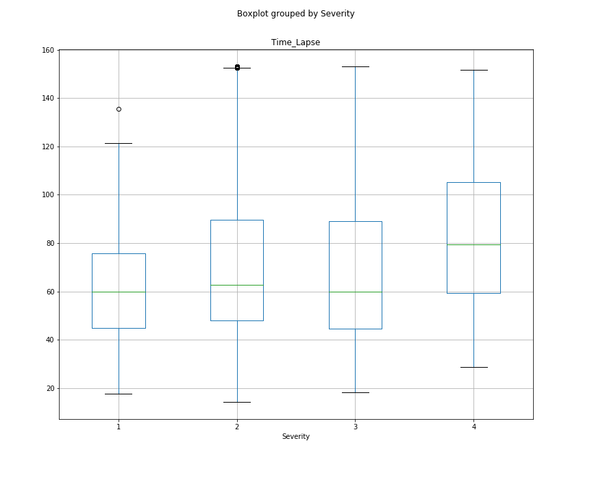

# mod2project
Andrew Ghandforoush & Maura Cerow
Data Source: https://www.kaggle.com/sobhanmoosavi/us-accidents

## Introduction

In this project, we set out to come up with a linear regression model that predicts the amount of delay time an accident causes. We used the 'US Accidents' dataset available on kaggle.com to build our model. We shrunk our scope to only look at accidents that happened in 2019.

The questions we're answering in this model - 

  1. What features impact our target variable delay time?
  2. How much do these feature impact delay time, meaning how big are our coefficients?
  3. How accurately can we predict delay time given these features?
  
 In order to start our analysis, we used the following libraries:
 
 ### Data Cleaning:
  1. NumPy
  2. Pandas
  3. Matplotlib
  4. Seaborn
  
### Modelling:
  1. NumPy
  2. Pandas
  3. Matplotlib
  3. Seaborn
  4. Train_test_split from sklearn.model_selection
  5. Metrics from sklearn
  6. Stats from SciPy
  7. OLS from Statsmodels.formula.api
  8. Statsmodels.api
  9. Pairwise_tukeyhsd from statsmodels.stats.multicomp
  10. Multicomparison from statsmodels.stats.multicomp
 
In this repo, you will find our jupyter notebooks as well as folders for csv files that relate to category codes and images.

## Data Collection & Cleaning

    see: 'Mod2Project - Data Cleaning'.ipynb
    
This notebook contains our data collection & cleaning. We imported a csv file that we downloaded from kaggle.com for US Accidents. We changed the datatypes for our time columns, 'Start_Time', 'End_Time' and 'Weather_Timestamp'. We calculated our 'Time_Lapse' column by subtracting our 'Start_Time' from the 'End_Time'. This will become our target variable. We also changed 'Weather_Timestamp' to only show as the year. We filtered for 2019 to limit our dataset to just accidents that happened last year. 

In our new 2019 dataframe, we cleaned our data for null values and outliers based on our 'Time_Lapse' column. We also changed our categorial features to integers using category codes. To see what these codes represent, see the csv folder for label-code files. We saved down a new csv file for just the 2019 data so that we could work with that for the modeling process.

## Hypothesis Testing & Linear Regression Modeling

    see: 'Mod2Project - Linear Regression Modeling'.ipynb
    
Now that our data has been cleaned and saved down, we began working in a new notebook. We imported our 2019 csv and dug in to some of our features using hypothesis testing.

Our first test was to understand if there was a difference between the severity of an accident and the delay time. We used a boxplot to see the distribution of the data between the 4 different severity levels (see below). We used an ANOVA table which confirmed statistical significance amongst the 4 groups. From there we ran 

<<<<<<< HEAD

=======
boxplot image
>>>>>>> master

## Conclusion

## Further Analysis

## Presentation Link
https://docs.google.com/presentation/d/1hXttDyQKVUWx4VMtPG3gqKFCGff1daldsM0aiq4nRaI/edit?ts=5e7cac7c#slide=id.g71e588802c_0_1547
