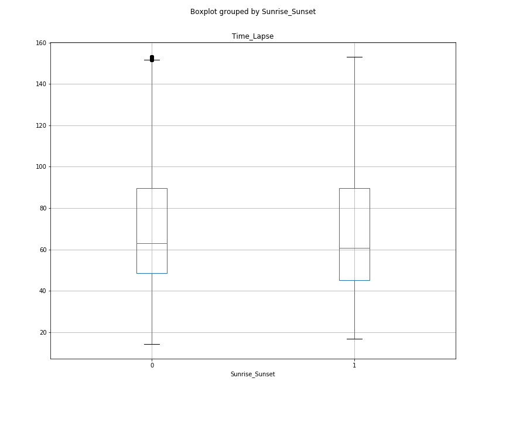

# Module 2 Final Project
Andrew Ghandforoush & Maura Cerow

Data Source: https://www.kaggle.com/sobhanmoosavi/us-accidents

## Introduction

In this project, we set out to come up with a linear regression model that predicts the amount of delay time an accident causes. We used the 'US Accidents' dataset available on kaggle.com to build our model. We shrunk our scope to only look at accidents that happened in 2019.

The questions we're answering in this model - 

  1. What features impact our target variable delay time?
  2. How much do these feature impact delay time, meaning how big are our coefficients?
  3. How accurately can we predict delay time given these features?
  
 In order to start our analysis, we used the following libraries:
 
 ### Data Cleaning:
  1. NumPy
  2. Pandas
  3. Matplotlib
  4. Seaborn
  
### Modelling:
  1. NumPy
  2. Pandas
  3. Matplotlib
  3. Seaborn
  4. Train_test_split from sklearn.model_selection
  5. Metrics from sklearn
  6. Stats from SciPy
  7. OLS from Statsmodels.formula.api
  8. Statsmodels.api
  9. Pairwise_tukeyhsd from statsmodels.stats.multicomp
  10. Multicomparison from statsmodels.stats.multicomp
 
In this repo, you will find our jupyter notebooks as well as folders for csv files that relate to category codes and images. Unfortunately, our data csv is not available here on github since it was too large to upload. You can download your own csv from the kaggle link above.

## Data Collection & Cleaning

    see: 'Mod2Project - Data Cleaning'.ipynb
    
This notebook contains our data collection & cleaning. We imported a csv file that we downloaded from kaggle.com for US Accidents. We changed the datatypes for our time columns, 'Start_Time', 'End_Time' and 'Weather_Timestamp'. We calculated our 'Time_Lapse' column by subtracting our 'Start_Time' from the 'End_Time'. This will become our target variable. We also changed 'Weather_Timestamp' to only show as the year. We filtered for 2019 to limit our dataset to just accidents that happened last year. 

In our new 2019 dataframe, we cleaned our data for null values and outliers based on our 'Time_Lapse' column. We also changed our categorial features to integers using category codes. To see what these codes represent, see the csv folder for label-code files. We saved down a new csv file for just the 2019 data so that we could work with that for the modeling process.

## Hypothesis Testing & Linear Regression Modeling

    see: 'Mod2Project - Linear Regression Modeling'.ipynb
    
Now that our data has been cleaned and saved down, we began working in a new notebook. We imported our 2019 csv and dug in to some of our features using hypothesis testing.

Our first test was to understand if there was a difference between the severity of an accident and the delay time. We used a boxplot to see the distribution of the data between the 4 different severity levels (see below). We used an ANOVA table which confirmed statistical significance amongst the 4 groups. From there we ran a Multicomparison test & saw our summary using TukeyHSD. We want to include this in our model.

We also wondered whether or not the time of day was relevant to our regeression model. Using the 'Sunrise_Sunset' column, we grouped our data by Day or Night. We used a two sample t test to determine that yes, the time of day impacts our delay time. We will want to make sure this feature is included when we build our model.

From here, we split our data into a train dataset and a testdata set. On our train data, we used every feature in our dataset to first model our target variable. From there, we addressed issues of multicollinearity and removed insignificat features from the model. We compared our train MAE, MSE and RMSE to our test MAE, MSE and RMSE to judge the accuracy of each model. Ultimately, we ended up with a model that has an R-Squared value of .86. We reduced redundancies and cut our total number of features from 29 to 15.

## Conclusion

All of our features impact delay time!
   
   Understand what there features are and how they affect delay time can help us predict delay time associated to an accident.
   Our next steps will include further analysis to help improve the amount of delay an accident causes at different levels.
 
Ultimately, given these features, we can predict what the delay time will be fairly close to the actual - waze, give us a call!

## Further Analysis

We want to improve the amount of time an accident causes, so our next steps include:

  Implement testing on the features that we can control such as:
      Crossing - Is a street crossing in a nearby location? Should there be one?
      No Exit - Is there a 'No Exit' sign nearby?
      Railway - Is there a railroad crossing?
      Traffic Signal - Is there a traffic signal nearby or should there be one?

  Conduct a state-by-state comparison:
      We saw that the state does in fact impact the delay time of an accident. We want to dig in to understand what is it
      about those states that are causing more or less delay times. Is it something to do with their response protocols that
      make them more efficient?
      
      From that, we want to create an efficiency marker to better equip states with a measure of how they're doing and what 
      steps they need to take to improve delays on the road.
     
     
## Presentation Link
https://docs.google.com/presentation/d/1hXttDyQKVUWx4VMtPG3gqKFCGff1daldsM0aiq4nRaI/edit?usp=sharing
